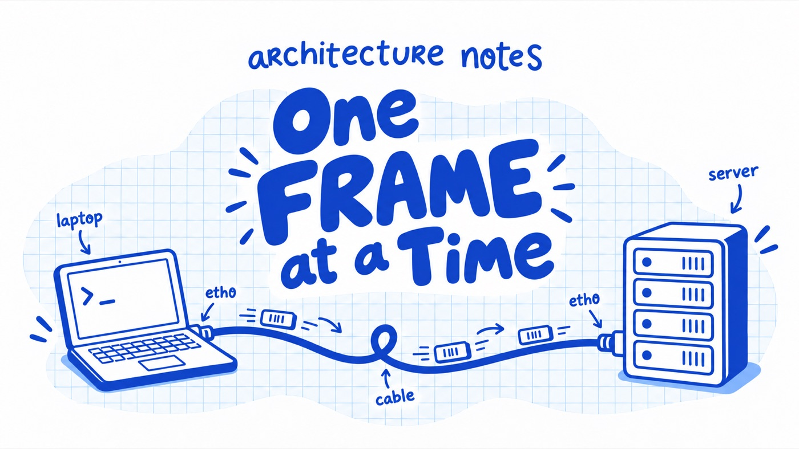

# Lantern



**One frame at a time.** An interactive site that shows how packets move
through a network. You have typed `ping` before. This is what happens after
you press enter, slowed down so that you can see it: the questions your laptop
has to ask first, the machines that answer, the way one packet is put into a
brand new frame at every router it crosses.

There is no video. Every lesson runs a real simulation of a tiny network, one
that speaks Ethernet, ARP, IPv4 and ICMP for real, and the picture on screen
is drawn from what it did. Every run also produces a packet capture that
Wireshark can open, which is how the simulation is tested and how the site
ends.

## The lessons

1. **Two hosts and a cable.** ARP, MAC addresses, and the first frame.
2. **Through a router.** IP addresses, routing tables, and why every hop
   rewrites the frame. Then a switch, and what it means to flood.
3. **Many routers.** Time to live, a routing loop, two ways home and the
   metric that picks between them, and traceroute.

One more thing waits at the end.

## Running it

The quickest way is the container. It needs nothing but Docker.

```sh
docker build -t lantern .
docker run --rm -p 3000:3000 lantern
```

Open <http://localhost:3000>.

For development you need Node 24 and pnpm 11 (`corepack enable` gives you the
pinned pnpm). Run the API and the web app side by side; Vite proxies `/api` to
the server.

```sh
pnpm install
pnpm --filter @lantern/server dev   # API on :3000
pnpm --filter @lantern/web dev      # site on :5173
```

## Tests

```sh
pnpm lint        # biome
pnpm typecheck   # tsc, every package
pnpm test        # vitest, every package
```

The engine tests write pcap files and have Wireshark's dissector read them
back, so they need `tshark` on the PATH. It is not a project dependency. If
you have Nix, run the suite under it:

```sh
nix shell nixpkgs#wireshark-cli -c pnpm test
```

Otherwise install `tshark` from your package manager. CI installs it with apt.

## How it is put together

A pnpm workspace with four packages.

| Package | What it is |
| --- | --- |
| `packages/engine` | The forwarding plane. Nodes are configured like Linux (`ip addr`, `ip route`, `ip neigh`), a discrete event simulation moves frames, and an event log is the source of truth. Hand-rolled Ethernet, ARP, IPv4 and ICMP encoders, and a pcap writer. No dependencies at runtime. |
| `packages/server` | A small Hono API. Runs a scenario, serves the event log, the capture, the lessons, and the glossary. Serves the built site in production. |
| `packages/web` | React and React Flow. The network on top, the narration and the frame inspector below, a stepper that walks the event log one turn at a time. |
| `packages/lessons` | No code. One directory per lesson: a `scenario.json` and a folder of markdown, one file per narration slot, plus the glossary. See its [README](packages/lessons/README.md) to write or edit a lesson. |

The design of the engine and the plan the project followed are in
[docs/engine-design.md](docs/engine-design.md) and [docs/plan.md](docs/plan.md).

## Deploying

CI builds the image and pushes it to `ghcr.io/myusuf3/lantern` on every push
to `main`. `docker-compose.yml` runs that image bound to loopback, for a host
where a reverse proxy terminates TLS in front of it.

| Variable | Default | Meaning |
| --- | --- | --- |
| `PORT` | `3000` | Port the server listens on |
| `LANTERN_LESSONS_DIR` | `packages/lessons` | Where lessons are read from |
| `LANTERN_STATIC_DIR` | unset | Built site to serve; unset in development, where Vite serves it |
